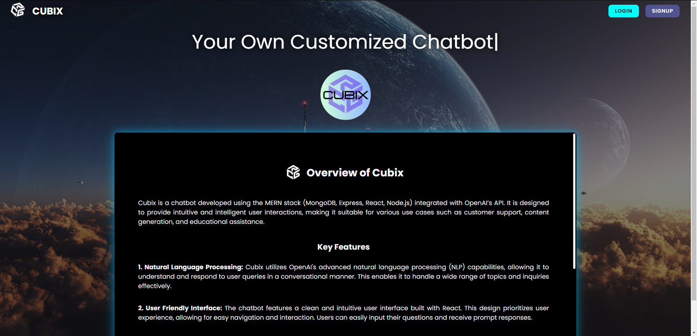

# Cubix - AI Chatbot



Cubix is an intelligent chatbot built using the MERN stack (MongoDB, Express.js, React, and Node.js) integrated with the OpenAI API. It is designed to provide conversational experiences, responding to user inputs and answering queries intelligently.

## Features

- **Interactive Chatbot**: Communicates with users in real-time using natural language processing.
- **MERN Stack**: Full-stack JavaScript application using MongoDB, Express.js, React, and Node.js.
- **OpenAI API Integration**: Cubix uses OpenAI's API to generate intelligent responses.
- **User Authentication**: Secure user login and registration with authentication mechanisms.
- **Responsive Design**: Optimized for various screen sizes and devices.
  
## Technologies Used

- **MongoDB**: NoSQL database used for storing user data and chatbot interactions.
- **Express.js**: Backend framework for creating APIs and handling requests.
- **React**: Frontend library used for building a responsive and interactive user interface.
- **Node.js**: Backend runtime environment for running the application.
- **OpenAI API**: Provides the chatbot's conversational intelligence.
  
## Installation

To set up and run Cubix locally, follow these steps:

1. Clone the repository:

    ```bash
    git clone https://github.com/Avishkar311/Cubix-Chatbot.git
    ```

2. Navigate to the project directory:

    ```bash
    cd Cubix-Chatbot
    ```

3. Install server dependencies:

    ```bash
    cd backend
    npm install
    ```

4. Install client dependencies:

    ```bash
    cd ../frontend
    npm install
    ```

5. Set up environment variables:
   
    Create a `.env` file in the `backend` directory with the following:
    ```
    MONGO_URI=your_mongo_connection_string
    OPENAI_API_KEY=your_openai_api_key
    ```

6. Run the development server:

    - Start the backend:

      ```bash
      cd backend
      npm start
      ```

    - Start the frontend:

      ```bash
      cd ../frontend
      npm start
      ```

7. Open the application in your browser:

    Visit `http://localhost:3000` to interact with the Cubix chatbot.

## Future Enhancements

- **Chat History**: Store and retrieve previous conversations.
- **Voice Interaction**: Add speech-to-text and text-to-speech functionality.
- **Admin Dashboard**: Manage user queries and interactions.

## Contributing

Contributions are welcome! Feel free to submit issues or pull requests to improve Cubix.
